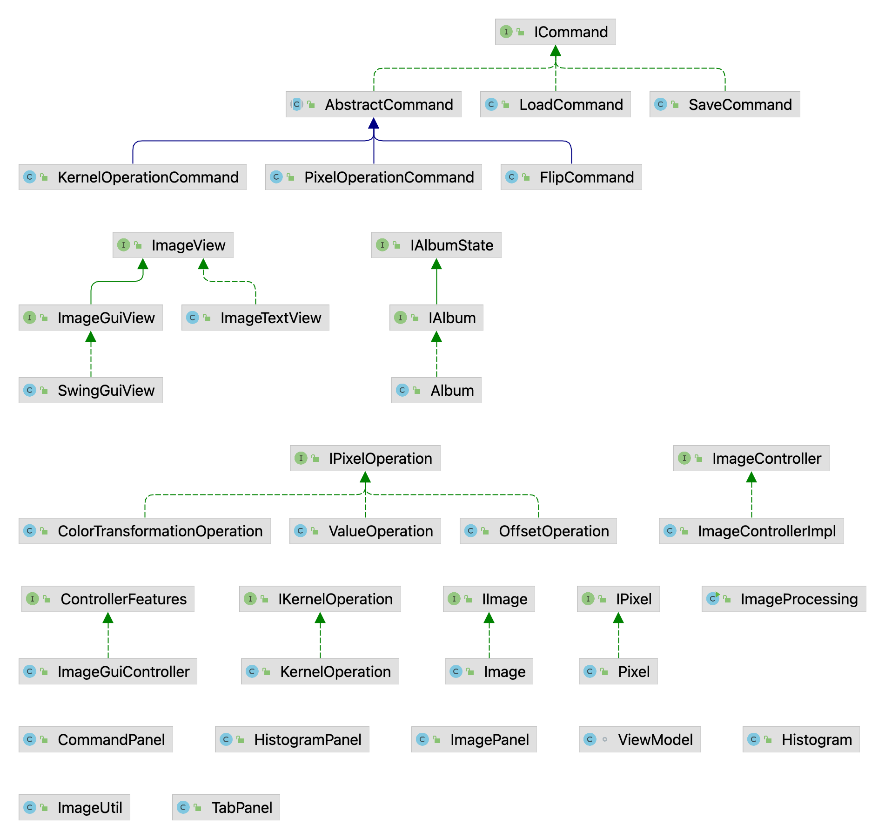

# Image Processing
### Kayla Nguyen and Brooke Chalmers

## Modifications

### November 22, 2022

* Refactored the `ICommand` interface so that `ICommand`s themselves don't take in a `Scanner`, so that
they can be used in the context of a GUI
* Refactored all implementors of `ICommand` to remove the code that prompts for input with a scanner
* Changed the mapping of commands inside the synchronous `ImageControllerImpl` from
`Map<String, ICommand>` to `Map<String, Function<Scanner, ICommand>>`, to support the new `ICommand` interface
* Added `ControllerFeatures` and `ImageGUIController` to the control package,
to provide an asynchronous controller for the GUI
* Modified method `imageToRenderedImage` to `imageToBufferedImage` in `ImageUtil`,
so that it can be used to provide `BufferedImage`s for drawing with Swing
(previously, it just returned a `RenderedImage` for `ImageIO`'s usage)
* Added a `Histogram` to the model package, to compute and represent the histogram of an image
* Added `CommandPanel`, `HistogramPanel`, `ImageGUIView`, `ImagePanel`, and `TabPanel` to represent different parts of the Swing GUI
* Added a `ViewModel` to represent the current state of the view across the various `*Panel` classes (which currently only includes the name of the active image)
* Added tests for new classes and methods

### November 11, 2022

* Renamed `ScaleColorTransformation` to `ColorTransformation` to better fit added operations
* Added `IKernelOperation`, `KernelOperation`, and `KernelOperationCommand` to work with kernels 
  and matrices.
* Added constructor for `Image` for compatibility with kernels
* Added constructor in `ColorTransformation` for compatibility with matrices
* Commands added: blur, sharpen, greyscale, sepia
* Added tests for new methods

## Diagram

## Design Overview

The model, `IAlbum`, represents an album containing multiple images.
Operations done by the user will add and remove images.
Once an image (`IImage`) is created, it cannot be mutated.

Images are represented as arrays of `IPixel`s, which are also immutable.

The `ImageTextView` provides a view which writes errors and messages to the terminal.

Image manipulations are represented as `IPixelOperation`s (on the pixel-by-pixel level)
and `Commands` (at the highest level). An `IPixelOperation` is a function
object which takes in some pixel and returns some altered pixel.

Many operations are represented as a `ColorTransformationOperation`,
which produces a new grayscale pixel by multiplying each component
of the original pixel by some scalar and then finding the sum. These include:

* Red, green, and blue components*
* Luma*
* Intensity*
* Grayscale (alternate method for luma)
* Sepia

Operations denoted with (*) produce grayscale pixels by using the same three scalars
for each component in the resulting image. Other operations are defined using
a matrix such that nine scalars are used in total to transform the original color to the new color.
Both types of transformations are handled by `ColorTransformationOperation`, as the
class will convert a three-scalar operation to the equivalent nine-scalar operation.

Other operations require additional logic. The `ValueOperation` implements the value
process (taking the maximum of the components), and the `OffsetOperation`
implements brightening and darkening by adding or subtracting some offset and
clamping the result.

The `KernelOperation` represents applying a kernel to an image, as used in the blur
and sharpening effects. It behaves similarly to an `IPixelOperation`, but since
it needs information about the surrounding pixels, it is an `IKernelOperation` instead.

Commands represent some action that the user can take to manipulate images.
An `ICommand` has an `apply` method which takes in the input `Scanner`, the
output `ImageView`, and the `IAlbum` to modify.

Most pixel operations can be represented by an instance of `PixelOperationCommand`.
However, brightening and darkening require getting an extra parameter. Thus,
they use `OffsetCommand`. Both kernel operations are represented with `KernelOperationCommand`. 

Flipping the image works at the level of the array, not the level of the pixel or its neighbors.
Thus, it is implemented as `FlipCommand`, but there is no underlying `IPixelOperation`
or `IKernelOperation`.

Loading and saving images are implemented as `LoadCommand` and `SaveCommand` respectively.

Every command except for load and save follows a similar structure: read any
associated parameters (e.g. brightening/darkening amount), read in the name
of the original image, read in the name for the
new image, apply some transformation to the old image to create the new image,
and add the new image to the album. This is abstracted in the `AbstractCommand<T>`
abstract class.

The type parameter `T` in `AbstractCommand` represents any additional parameters
that the command needs to create the new image. For `OffsetCommand`, representing
brightening and darkening, `T` is an `Integer` representing how much to brighten or
darken the image. None of the other commands currently have associated
parameters, so `T` is simply `Void`. Commands override a method to retrieve
any necessary parameters, then override a second method to carry out the
creation of the new image.

Images are read and saved in the `ImageUtil` class. If the file extension to be loaded
or saved is `.ppm`, the `ImageUtil` will use its own `savePPM` or `readPPM` methods
to save or read the image data. Otherwise, it will delegate to Java's `ImageIO` class.

## Usage Instructions

Run the program with no arguments (`java -jar ImageProcessing.jar`) to use the GUI.

Run the program with `java -jar ImageProcessing.jar -text` to run in text mode, allowing
you to type commands into a terminal to manipulate images.

Run the program with `java -jar ImageProcessing.jar -file res/script.txt` (or a path to a different script file)
to run a script file without prompting for input.

## Image Citation

### `rocks.ppm`, `dock.bmp`, `mountains.jpg`, and `sunset.png`

These photographs were taken by Brooke, who authorizes their use in this project.
The originals can be found [here](https://www.instagram.com/p/CgFZO6IJ8Zz/).
